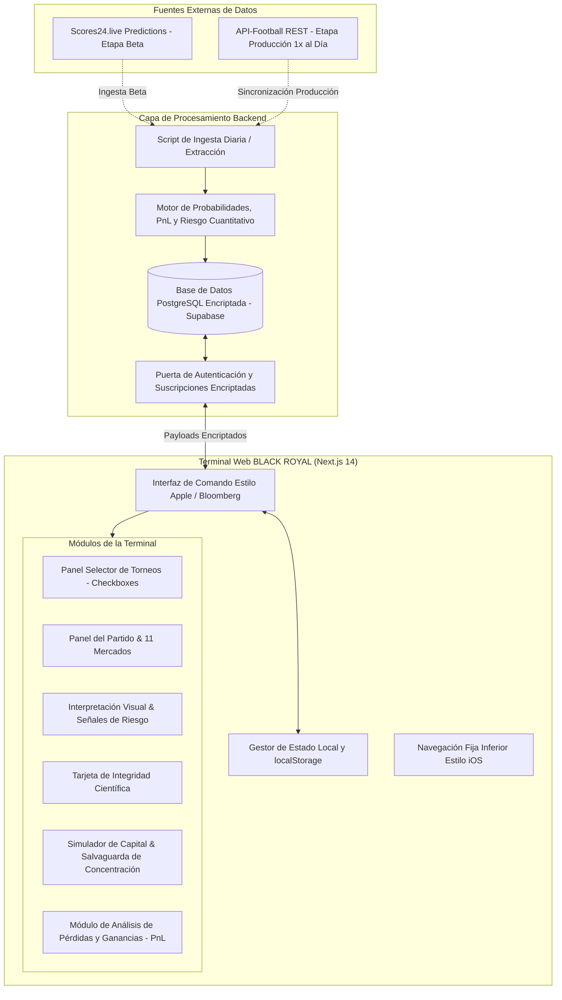

# 👑 Plan de Implementación: Terminal de Inteligencia Deportiva BLACK ROYAL

Este documento establece la arquitectura completa, el sistema de diseño, el modelo de datos, los protocolos de seguridad y el plan de implementación interactivo para **BLACK ROYAL**: una terminal cuantitativa de inteligencia deportiva enfocada **exclusivamente en Fútbol**, que combina la densidad visual de **Bloomberg Terminal**, la precisión gráfica de **TradingView** y la elegancia minimalista de **Apple Stocks & Widgets de iOS**.

---

## 🎯 Visión del Proyecto y Premisas Fundamentales

> [!IMPORTANT]
> **OBJETIVO PRINCIPAL DE BLACK ROYAL**:
> Convertirse en un **asistente estratégico y minimalista** que ayude al usuario en la toma de decisiones. El sistema procesa y simplifica datos cuantitativos complejos de fútbol para presentar escenarios claros, medir la incertidumbre y visualizar el riesgo, sin prometer resultados ni parecer una casa de apuestas.

### ⚽ Enfoque Exclusivo en Fútbol y Selector de Torneos
* **Especialización**: La plataforma está 100% optimizada para ligas y torneos de fútbol profesional a nivel mundial.
* **Panel Selector de Torneos**: Panel desplegable/modal interactivo con casillas de verificación (checkboxes) para activar o desactivar ligas específicas (ej. Premier League, LaLiga, Champions League, Serie A, Bundesliga, Liga MX, Copa Libertadores). Los partidos se filtran en tiempo real sin recargar la página y la selección se persiste en `localStorage`.

### 📊 Módulo de Análisis de Pérdidas y Ganancias (PnL Analytics)
> [!IMPORTANT]
> **Análisis Cuantitativo de Pérdidas y Ganancias (PnL)**:
> La terminal incluirá un módulo dedicado de **Pérdidas y Ganancias Simulado (Profit & Loss / PnL)** que muestra:
> 1. **Ganancia/Pérdida Neta Hipotética ($ y %)**: Rendimiento acumulado sobre la banca simulada.
> 2. **Rendimiento sobre Capital (ROC %)** y **Retorno Esperado (EV / Value Ratio)**.
> 3. **Gráfica de Curva de Capital (Equity Curve estilo TradingView)**: Histórico simulado de PnL a lo largo del tiempo.
> 4. **Métricas de Rendimiento Cuantitativo**: Win Rate (Tasa de Aciertos Simulado), Profit Factor, Max Drawdown (% de Caída Máxima) y Ratio de Riesgo/Beneficio (Estilo Sharpe Ratio).

### 🌐 Fuente de Datos para la Versión Beta Inicial
* **Estrategia de Ingesta para la Versión Beta**: Para la etapa inicial (Versión Beta), los datos de partidos, probabilidades y pronósticos se obtendrán mediante un script de extracción e ingesta desde **[scores24.live/es/predictions/soccer](https://scores24.live/es/predictions/soccer)**.

### 🎨 Identidad Visual y Estética
* **Concepto**: Centro de mando de analítica de fútbol de alto nivel (**NO parece una casa de apuestas**).
* **Fusión Estética**: Bloomberg Terminal (alta densidad de datos, tono grafito/obsidiana, tipografía de precisión) + TradingView (gráficos interactivos dinámicos de PnL) + Apple Stocks / Health (widgets minimalistas, cristal pulido/glassmorphism, microinteracciones suaves).
* **Paleta de Colores**: Grafito Profundo (`#0B0E14`), Obsidiana (`#121824`), Verde Esmeralda Impulso (`#00F090` - PnL positivo / bajo riesgo), Ámbar Bloomberg (`#FFB000` - advertencia / PnL neutro), Rojo Carmesí (`#FF3B30` - PnL negativo / riesgo elevado), Cían Eléctrico (`#00E5FF` - métricas de datos).

---

## 🏗️ Diagrama de Arquitectura y Componentes



---

## 📐 Especificaciones de Arquitectura Visual y Experiencia de Usuario (UX)

### 1. Disposición e Interfaz
* **Barra de Comando Superior**: Reloj de Mercado en Vivo, Indicador de Ingesta de Datos (`SCORES24 BETA`), Resumen PnL en Tiempo Real (`+$1,450.00 / +14.5%`), Perfil de Usuario, Botón Selector de `TORNEOS DE FÚTBOL`, Botón de Acción `REINICIAR DEMO`.
* **Panel Selector de Torneos y Ligas**:
  * Lista con casillas de verificación (checkboxes) agrupadas por región o tipo (Top Ligas Europeas, Competiciones UEFA, Ligas Latinoamericanas, Selecciones).
  * Acciones Rápidas: `SELECCIONAR TODAS`, `DESSELECCIONAR TODAS`, `TOP 5 LIGAS`.
* **Carrusel Selector de Partidos**: Deslizador horizontal rápido que muestra el estado del encuentro, equipos, escudo de la liga y los scores principales (`MarketScore` / `RiskScore`).
* **Panel del Partido (Match Panel)**:
  * Encabezado: Local vs Visitante con racha de forma, liga y fecha/hora.
  * Pestañas de Navegación de Mercados: `RESUMEN`, `GOLES`, `RESULTADO`, `CORNERS`, `DISCIPLINA`, `COMBINADOS`.
  * Mercados Iniciales: 1X2, Doble Oportunidad, Ambos Anotan, Over/Under 2.5 Goles, Total Goles, Corners, Tarjetas, 1ª Mitad, 2ª Mitad, Resultado + Over/Under, Doble Oportunidad + Goles.
* **Módulo de Interpretación Visual Automática**:
  * 🟢 `SEÑAL MÁS CONSISTENTE`
  * 🔵 `RIESGO MÁS BAJO`
  * 🟡 `MERCADO CON MAYOR INCERTIDUMBRE`
  * 🔴 `MERCADO A EVITAR`
* **Scorecard de Integridad Científica (Scientific Integrity)**:
  * Widgets de Métricas: `Data Coverage` (%), `Model Confidence` (%), `Source Quality` (Puntuación), `Sample Size` (n Partidos).
  * Insignia de Score General de Integridad (ej. `8.9 / 10 - INTEGRIDAD ALTA`).
* **Módulo de Análisis de Pérdidas y Ganancias (PnL Analytics)**:
  * **Resumen Ejecutivo PnL**: `Ganancia/Pérdida Neta ($)`, `Retorno sobre Banca (ROC %)`, `Tasa de Aciertos (Win Rate %)`, `Factor de Beneficio (Profit Factor)`.
  * **Gráfica de Curva de Capital (Equity Curve estilo TradingView)**: Evolución del PnL en función de los escenarios y selecciones simuladas.
  * **Desglose de PnL por Mercado**: Comparativa de rendimiento simulado entre mercados (ej. 1X2 vs Over/Under vs Doble Oportunidad).
* **Simulador de Capital y Riesgo**:
  * Entrada Interactiva de Banca (predeterminado `$10,000`).
  * Contadores dinámicos en tiempo real: `Capital Disponible`, `Capital Hipotéticamente Asignado`, `Capital Sin Exponer`, `Riesgo Acumulado`.
  * Salvaguarda de Exposición Por Partido: Muestra `Exposición por Partido` y `Concentración de Riesgo`. Activa una alerta pulsante **`⚠ CONCENTRACIÓN EXCESIVA`** si la asignación a un solo partido supera el 15% de la banca.
* **Navegación Inferior Estilo iOS**: Barra fija en la parte inferior con microinteracciones táctiles para alternar entre: `TERMINAL`, `GRÁFICAS` (PnL), `JORNADA`.

---

## 🔒 Seguridad, Encriptación y Esquema de Datos

### 1. Esquema de Base de Datos (`Supabase / PostgreSQL`)

```sql
-- Usuarios y Suscripciones (Máximo 20 Suscriptores)
CREATE TABLE user_profiles (
  id UUID PRIMARY KEY DEFAULT gen_random_uuid(),
  email TEXT UNIQUE NOT NULL,
  role TEXT CHECK (role IN ('admin', 'subscriber')) DEFAULT 'subscriber',
  subscription_status TEXT CHECK (subscription_status IN ('active', 'expired', 'cancelled')),
  subscription_expires_at TIMESTAMPTZ,
  created_at TIMESTAMPTZ DEFAULT now()
);

-- Datos Diarios Cachados de Partidos (Origen: Scores24 Beta / API-Football Prod)
CREATE TABLE daily_matches (
  id TEXT PRIMARY KEY, -- ej. "MATCH-2026-08-07-001"
  data_source TEXT DEFAULT 'scores24_beta',
  league_id INT,
  league_name TEXT NOT NULL,
  league_logo TEXT,
  home_team TEXT NOT NULL,
  away_team TEXT NOT NULL,
  match_time TIMESTAMPTZ NOT NULL,
  market_score NUMERIC(4,2),
  risk_score NUMERIC(4,2),
  confidence_score NUMERIC(4,2),
  data_coverage NUMERIC(4,2),
  sample_size INT,
  pnl_projection_json JSONB, -- Proyecciones cuantitativas de Pérdidas y Ganancias por mercado
  markets_json JSONB NOT NULL,
  updated_at TIMESTAMPTZ DEFAULT now()
);
```

---

## 🛠️ Plan de Trabajo por Fases

### Fase 1: Base e Inicialización del Sistema de Diseño (Workspace Actual)
1. Inicializar el proyecto Next.js 14 App Router en `/Users/ivanTemp/Sites/Benito`.
2. Configurar Tailwind CSS con la paleta exclusiva Black Royal (`graphite`, `obsidian`, `bloomberg-amber`, `emerald-pulse`, `cyan-data`).
3. Construir componentes base reutilizables: Tablas de datos estilo Bloomberg, Widgets estilo Apple, Insignias de Riesgo, Sliders, Contadores Animados.

### Fase 2: Selector de Torneos y Terminal Interactiva del Partido (Datos Beta Scores24)
1. Ingesta e integración de datos Beta estructurados desde `scores24.live/es/predictions/soccer`.
2. Construir el **Panel Selector de Torneos y Ligas** con casillas de verificación (checkboxes) y persistencia local.
3. Implementar el Panel del Partido con selección de equipos y pestañas de mercado (`RESUMEN`, `GOLES`, etc.).
4. Crear el motor visual de gráficos usando SVG / Recharts para distribuciones de probabilidad y comparación de mercados.
5. Integrar las tarjetas de Interpretación Visual Automática (`SEÑAL MÁS CONSISTENTE`, `RIESGO MÁS BAJO`, `MERCADO A EVITAR`).
6. Implementar el módulo de Integridad Científica con desglose de puntuación.

### Fase 3: Módulo de Análisis de Pérdidas y Ganancias (PnL) & Simulador de Capital
1. Desarrollar la pantalla y widgets de **Análisis de Pérdidas y Ganancias (PnL)** con Curva de Capital estilo TradingView.
2. Crear el widget interactivo de asignación de banca simulada y cálculo de PnL proyectado.
3. Implementar la lógica de cálculo de riesgo: Exposición por Partido, Exposición Total, Concentración de Riesgo.
4. Activar la alerta **`⚠ CONCENTRACIÓN EXCESIVA`** cuando el riesgo por partido supere el 15%.

### Fase 4: Persistencia Local y Mecanismo de Reinicio
1. Sincronizar el estado con `localStorage` para torneos seleccionados, selecciones de partidos, banca, simulación de PnL y filtros.
2. Implementar el botón global **`REINICIAR DEMO`** para restaurar el estado original del sistema.

### Fase 5: Conexión con API-Football y Panel de Administración de Suscriptores
1. Conectar script de ingesta automatizada desde API-Football para la versión de producción.
2. Implementar autenticación con Supabase, restricción de roles (Admin + 20 Suscriptores) y encriptación de datos.

---

## ❓ Confirmación y Revisión del Usuario

> [!IMPORTANT]
> **Módulo de Pérdidas y Ganancias (PnL) Incorporado**: Se ha integrado formalmente el módulo de Análisis de Pérdidas y Ganancias (PnL), Curva de Capital (Equity Curve estilo TradingView) y ratios de rendimiento en la arquitectura de BLACK ROYAL.

---

## 🧪 Plan de Verificación y Control de Calidad

### Verificación Automatizada
* `npm run build`: Verificar tipos en TypeScript y compilación del paquete de producción en Next.js.
* `npm run lint`: Comprobar la calidad del código.

### Verificación Manual
* Validar que los cálculos de Pérdidas y Ganancias (PnL $, ROC %, Win Rate %) se actualicen en tiempo real al cambiar partidos, mercados o asignación de banca.
* Verificar la representación gráfica de la Curva de Capital (Equity Curve) en la pestaña `GRÁFICAS`.
* Probar el marcado/desmarcado de torneos y comprobar que los partidos se filtran dinámicamente sin recargar la página.
* Probar el slider de banca simulada y validar que la alerta **`⚠ CONCENTRACIÓN EXCESIVA`** se active dinámicamente.
* Probar la persistencia en `localStorage` y verificar que el botón **`REINICIAR DEMO`** limpie el almacenamiento local.
